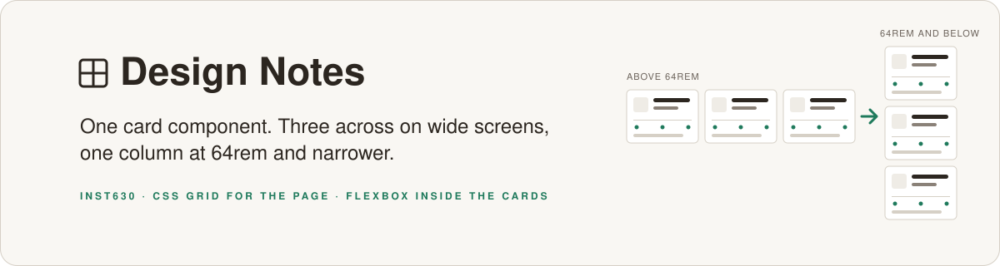
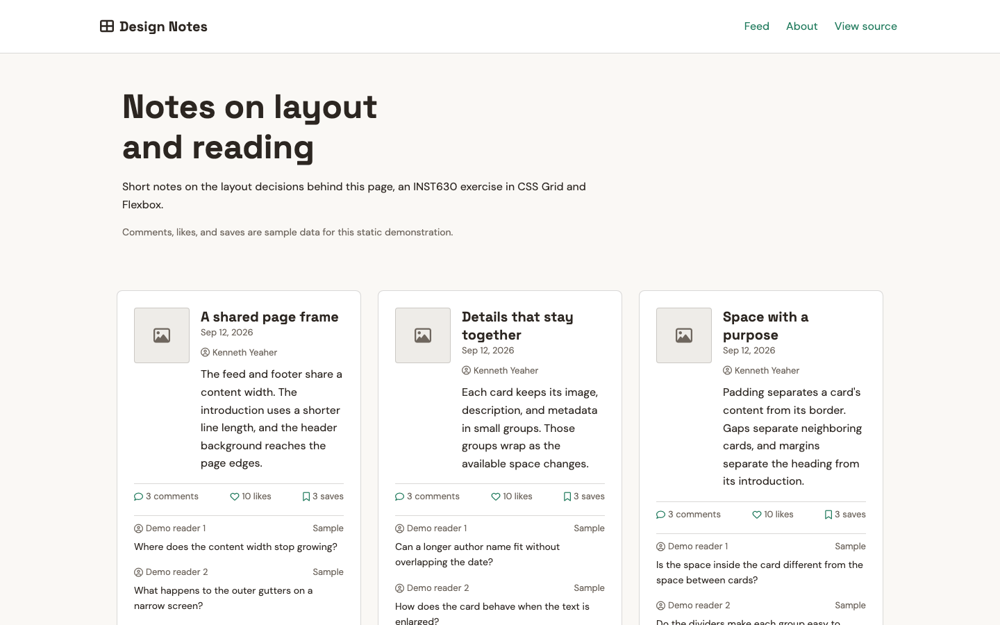
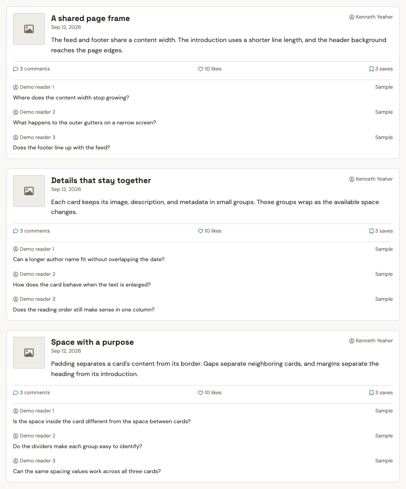
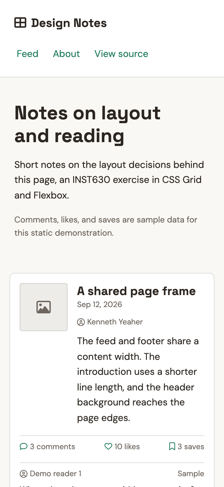
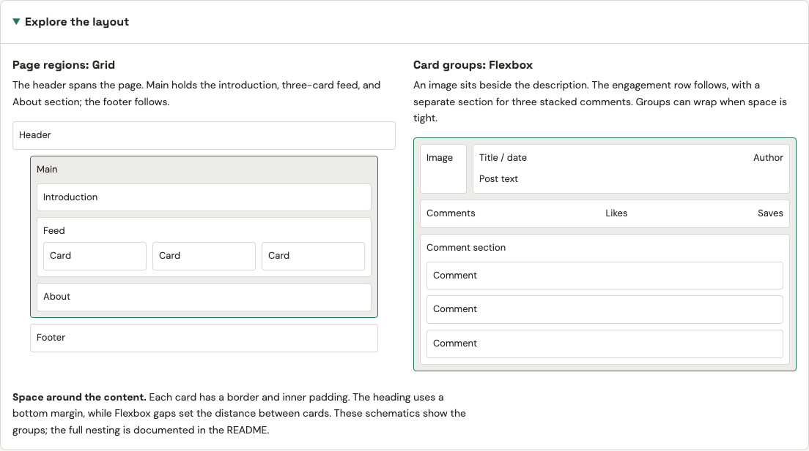
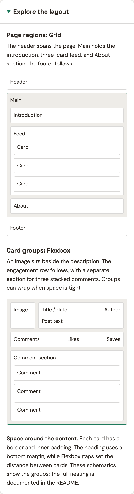

<p align="center">
  
</p>

<p align="center">
  <strong>INST630 Homework 2: Grids and Flex.</strong><br>
  A static feed of three short notes about this page's layout, built with plain HTML and CSS. The cards adapt the documented <code>component-compex</code> structure from the course Figma file. They share a row on screens wider than 64rem and stack into a column at 64rem and narrower.
</p>

<p align="center">
  
  
  <a href="https://kennethyeaher.github.io/KY_gridsFlexLab/"></a>
  
</p>

<p align="center">
  <a href="https://kennethyeaher.github.io/KY_gridsFlexLab/"><strong>Open the live page ↗</strong></a> &nbsp; · &nbsp;
  <a href="#layout-guide">Layout guide</a> &nbsp; · &nbsp;
  <a href="#what-it-demonstrates">What it demonstrates</a> &nbsp; · &nbsp;
  <a href="#homework-requirement-coverage">Requirements</a> &nbsp; · &nbsp;
  <a href="#known-limitations">Known limitations</a>
</p>

---



<details>
<summary><strong>See the stacked layout at 64rem and narrower</strong></summary>
<br>

<table>
  <tr>
    <th>1024px, the 64rem breakpoint</th>
    <th>375px phone</th>
  </tr>
  <tr>
    <td width="62%"></td>
    <td width="38%"></td>
  </tr>
</table>

</details>

The notes cover the shared page frame, the groups inside each card, and
the use of spacing. Comments are example discussion prompts from named
demo readers. Likes and saves are illustrative counts. None of these
counts represent measured use of the project.

## My contribution

I adapted the course component into a responsive three card feed, wrote the layout notes, and added the expandable layout guide. The course reference and remaining checks are documented below.

## Review the layout

Start with the three cards at desktop width, then narrow the window to see them stack. Open **Explore the layout** to compare the page regions with the groups inside a card. The guide makes the distinction between Grid for page structure and Flexbox for smaller groups visible in the page itself.

This is a static layout study. The sample engagement counts illustrate hierarchy and do not represent a functioning social feed.

## Layout guide

The page carries its own explainer. **Explore the layout** opens two schematics, one for the Grid regions of the page and one for the Flexbox groups inside a card.



<details>
<summary><strong>See the guide at 375px</strong></summary>
<br>
<p align="center"></p>
</details>

## What it demonstrates

Grid handles the page. `.page-layout` on `body` defines three named areas
(header, content, footer) on a three column grid. The outer columns are
flexible gutters and the middle column caps content at 72rem. The header
spans all three columns so its background reaches the edges. A nested grid
on `.page-content` places the hero, list, and About section inside one main
landmark. The footer shares the main content width.

Flexbox handles everything inside a region. The nav is a flex row with
`space-between`. Each card is a flex column, and inside it the image and
description form a row, the title and author form a row, the three
engagement metrics form a row, and the comments stack as a column. The card
groups retain the documented Figma layer tree. Rows can wrap when their
contents need more room, including long names or enlarged text.

The box model shows up in the cards: a 1px border, 1.5rem of desktop padding
(1rem in the stacked layout), and the content boxes inside. The heading uses
`margin-bottom` to separate it from the introduction, and `margin: 0 auto`
centers the header navigation. Flex `gap` separately controls space between
cards and between their inner groups; it is not part of a card's margin.
`box-sizing: border-box` makes declared widths include padding and borders.

External resources are two Google Fonts (Space Grotesk and DM Sans) and
Font Awesome 6 for the icons in the header, cards, and footer.

## Design decisions

The page keeps the warm background, green links, Space Grotesk headings,
and DM Sans body text from the initial exercise. Shared spacing and text
sizes keep the repeated cards consistent.

| Decision | Reason and implementation |
| --- | --- |
| Three cards, with one stacking breakpoint | The homework asks for a row at large sizes and a column at small ones. The 64rem breakpoint gives the nested card groups more room before they stack. |
| Short introduction, wider feed | The introduction caps at 48rem; the main content and footer share a grid track capped at 72rem. |
| Clear text hierarchy | The main heading scales from 2rem to 3rem. Card titles use 1.25rem, post text 1rem, and shared smaller sizes distinguish comments and metadata. |
| Explicit sample activity | Demo readers and labeled sample counts make the static feed's purpose clear. Each comment count matches the three comments shown. |
| An optional layout guide | Native HTML details/summary reveals captioned schematics for the page grid and card nesting. The diagrams follow the page's stacking breakpoint. |

The guide's captions describe the groups in text. Its duplicate visual
labels are hidden from assistive technology. The guide uses HTML and CSS;
no scripting or new external resources are required.

### Implementation evidence and remaining checks

Source checks confirm three cards with matching element nesting, valid
named anchor targets and accessible labels, and three comments per card.
Calculated secondary-text contrast is 5.64:1 on white and 5.32:1 on the
warm page background. These are color calculations, not a complete
accessibility assessment.

Two desktop Safari screenshots reviewed on September 12, 2026 show the
local page with its header, three cards in a row, About section, and expanded
layout guide. The visible text, icons, and diagrams render without obvious
overlap in the areas shown. The screenshots do not establish an exact CSS
viewport width, show the entire page, or demonstrate keyboard interaction.

Three mobile Safari screenshots reviewed the same day show the published
page's wrapped header navigation, a card fitting the screen, About text,
the expanded layout guide, and the actual footer. Text and diagram groups
fit their visible containers without obvious overlap. The screenshots
cover selected portions of the page, not every card or an exact CSS
viewport width, and do not establish that every control works.

A screenshot of the course Figma Components page shows `component-compex`
with an image beside its description, an engagement row, and three stacked
comments. These main groups match the implementation. The project adds
original text, its own font and color choices, and responsive wrapping. The
screenshot does not establish exact dimensions or a detailed comparison of
every layer.

A headless Chromium check on October 3, 2026 against the published page found the three cards in one row at 1025px and stacked in one column at 1024px, with no horizontal scrolling at 320, 375, 768, 1024, 1025, or 1440px. It measured card positions and page width only; it did not test zoom, keyboard use, or other browsers.

GitHub Pages successfully deployed the page reviewed on mobile from the
`main` branch and root folder. Both sides of the breakpoint, zoom behavior,
keyboard and screen-reader use, link activation, and detailed reference
fidelity remain unverified. The manual procedure below describes those
checks. There are no measured usability or performance results to report.

### Homework requirement coverage

| Requirement | Current evidence | Remaining check |
| --- | --- | --- |
| Use a component from the course Figma file | The Figma screenshot identifies `component-compex` and shows the main groups used in each card. | Compare the detailed layers and starter material. |
| Build nested boxes and preserve their visual relationships | The HTML groups the image, description, metadata, engagement row, and comments; the Figma screenshot supports these main relationships. | Confirm detailed reference fidelity at the intended sizes. |
| Repeat the component three times in a large-screen row and small-screen column | Three article elements are present, the desktop row is visible, and CSS switches to a column at 64rem. A mobile card fits the screen in the supplied view. A headless Chromium check found the row at 1025px and the column at 1024px. | Review all three cards on mobile and repeat the boundary check in other browsers. |
| Include a header and footer organized with CSS Grid | Both are assigned named grid areas. The header appears in desktop and mobile screenshots, and the actual footer appears on mobile. | Review the full desktop footer and widths not covered by the screenshots. |
| Demonstrate Flexbox, Grid, nesting, and the box model | The source and layout guide identify flex groups, grid regions, borders, padding, margins, and gaps. | Inspect the applied styles in browser developer tools. |
| Include external resources | The HTML links Google Fonts and Font Awesome; icons appear in desktop and mobile screenshots. | Check the font and icon requests in the browser. |
| Test in a browser and submit an inspectable live link | Desktop local and published mobile rendering have screenshot evidence. GitHub Pages deployment succeeded, and the live page links to the source repository. | Finish link, keyboard, zoom, and remaining responsive checks. |

## Known limitations

The image is a placeholder box with an icon rather than a real photo, since
the Figma component uses a placeholder too. Colors and fonts are my own
choices, not pulled from the Figma file. This is a static demonstration;
comments, likes, and saves have no interactive controls or persistence.
Visual review covers the supplied desktop and mobile screenshots and the
main Figma component groups. It is not a complete accessibility audit or a
test of every screen size and interaction. The remaining checks are listed
above.

---

## Run it locally

Clone the repo and open `index.html` in a browser. The fonts and icons load
from their CDNs, so an internet connection is needed for them to appear.
Without one the layout still works with the system font fallbacks.

<details>
<summary><strong>Responsive and keyboard checks</strong></summary>
<br>

Use the browser's responsive tools at 320px, 390px, 768px, 1024px, 1025px,
and 1440px. With the default 16px browser font size, 64rem equals 1024px:
three cards should share one row above that width, and stack at or below it.
Check for overlap, clipped text, and unwanted horizontal scrolling. Also
check browser zoom at 200% and 400%.

Press Tab from the top of the page. The first link should become visible
as "Skip to main content"; Enter should move focus to the main landmark.
Continue with Tab and Shift+Tab to check the visible focus outlines on
header and footer links. Follow Feed and About to their labeled sections,
and check the repository and Figma links. Tab to "Explore the layout" and
use Enter or Space to open and close it. Confirm that the text captions are
available to a screen reader and the duplicated schematic labels are skipped.
Open the guide at both sides of the 64rem breakpoint and check that its
page map stacks with the feed.

Secondary text uses a darker shared color, and navigation links have a
minimum height of 2.75rem. These changes support readability and keyboard
use; they do not establish a complete accessibility audit. The checks above
are a manual verification procedure, not a record of completed browser tests.

</details>

<details>
<summary><strong>Project structure</strong></summary>
<br>

```
KY_gridsFlexLab/
  README.md
  .gitignore
  index.html        page, three cards, and expandable layout guide
  css/
    style.css       shared styles, grids, flex groups, and breakpoint
```

There is no build step and no JavaScript. Feed and About link to sections
on the page. View source opens this repository; the About section also
links to the course Figma reference. Each card contains three comments,
and its comment count matches those visible examples.

</details>

<details>
<summary><strong>Component reference</strong></summary>
<br>

Source: INST630 Figma Demos (2026, Kunesh), Components page,
`component-compex`. Layer tree recreated in the HTML:

```
component-compex
  main-content
    image
    description
      header
        title-date
        author
      text
  engagement-bar
    engagement-metric x3 (icon, label)
  comment-section
    comment x3
      header (author, time)
      text
```

</details>

<details>
<summary><strong>Publish with GitHub Pages</strong></summary>
<br>

Pages is already configured for this repository: deploy from the `main`
branch and `/ (root)` folder.

After reviewing and committing a change, run `git push origin main`.
GitHub's `pages build and deployment` workflow publishes it. Wait for that
workflow to succeed, then refresh the
[live page](https://kennethyeaher.github.io/KY_gridsFlexLab/) and check the
changed content. No local build step is required.

</details>

---

## Author

**Kenneth Yeaher**  
MS in Human Computer Interaction  
University of Maryland, College Park  
[](https://www.linkedin.com/in/kennethyeaher/)

`CSS Grid` · `Flexbox` · `Responsive Layout`
